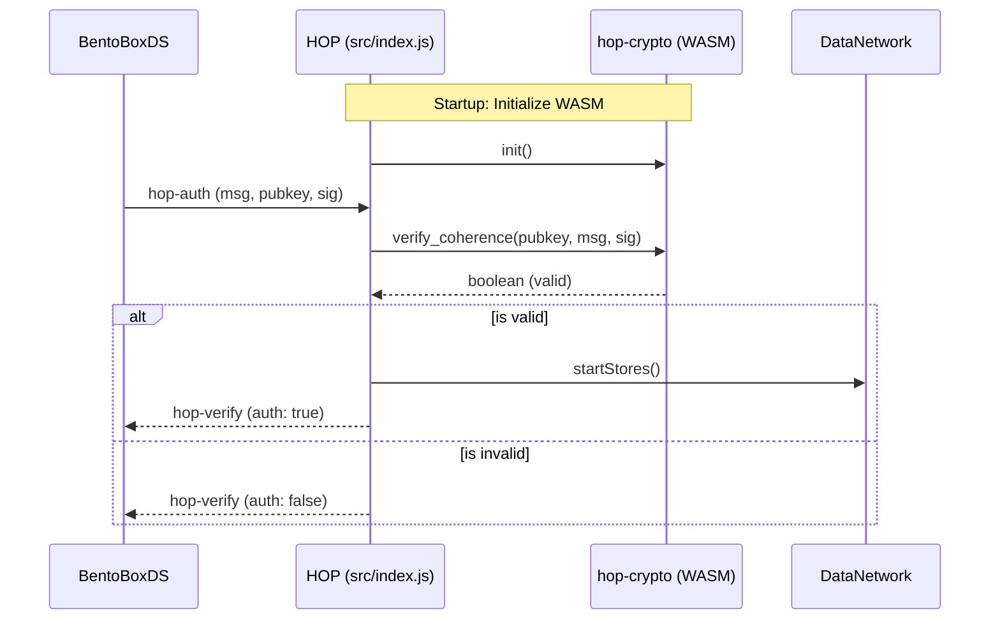

# Plan: Integrate `hop-crypto` WASM

## Overview
Integrate the `hop-crypto` WASM module into the `HOP` protocol to enable Schnorr signature verification and other cryptographic operations. This will be initialized at startup and used during the authentication flow.

## Architecture
- **Initialization**: `hop-crypto` will be initialized in `src/index.js` within the `startPtoPnetwork` method, similar to `heliclock-hop`.
- **Context**: The initialized crypto functions will be added to the `this.context` object, making them available to all routes (SafeFlow, Library, etc.).
- **Authentication**: The `messageAuth` method in `src/index.js` will be updated to use `verify_coherence` from `hop-crypto` to validate Schnorr signatures from `BentoBoxDS`.
- **Routing**: New message types/actions will be added to `messageResponder` to handle crypto requests from `BentoBoxDS`.

## Proposed Changes

### 1. `package.json`
Add `hop-crypto` dependency:
```json
"hop-crypto": "git+https://github.com/healthscience/hop-crypto.git"
```

### 2. `src/index.js`
- Import `initCrypto` and `verify_coherence` from `hop-crypto`.
- Update `startPtoPnetwork` to initialize the WASM.
- Update `messageAuth` to implement signature verification.

### 3. `src/safeflow/index.js` (Optional/Future)
- Utilize `hop-crypto` for secure state transitions if required.

## Mermaid Diagram

