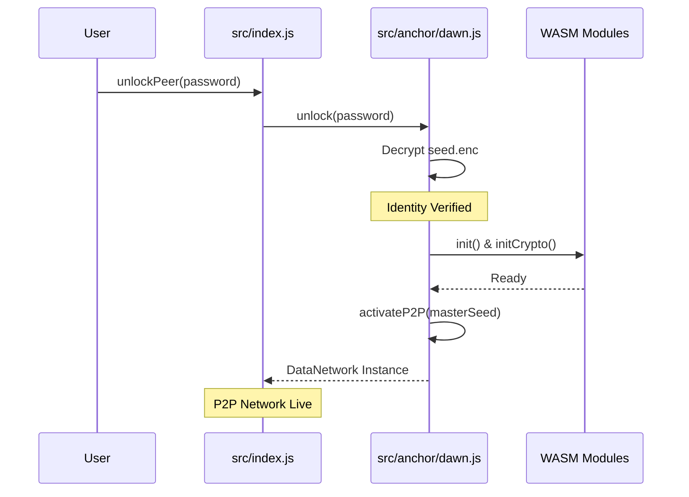

# Refactor Plan: P2P Network Activation & WASM Consolidation

## Overview
This plan outlines the refactoring of the P2P network initialization in the HOP protocol. The goal is to move the activation logic from [`src/index.js`](src/index.js) into [`src/anchor/dawn.js`](src/anchor/dawn.js), ensuring that the network only starts after a successful identity (seed) verification and unencryption.

## Current Issues
- **Redundant WASM Initialization**: `init()` and `initCrypto()` are called in [`src/index.js`](src/index.js) before the peer's identity is even verified.
- **Premature Network Start**: The P2P network should be gated by the "Dawn" phase (identity unlocking).
- **Code Fragmentation**: Initialization logic is spread across multiple files, making it harder to maintain the "Cold Mode" vs. "Live Mode" state.

## Proposed Changes

### 1. Update `src/anchor/dawn.js`
- **Encapsulate WASM Initialization**: Move all `init()` and `initCrypto()` logic into a private or internal method within `AnchorDawn`.
- **Add `activateP2P(masterSeed)`**: Create a new method that:
    - Initializes HeliClock and `hop-crypto` WASM.
    - Sets up the `HolepunchHOP` data network using the provided `masterSeed`.
    - Returns the initialized network instance.
- **Add `unlock(password)`**: Implement the logic to read `seed.enc`, derive the encryption key, and decrypt the master seed.

### 2. Refactor `src/index.js`
- **Remove `startPtoPnetwork`**: Delete the method from lines 83-115.
- **Remove WASM Imports**: Clean up imports related to `init`, `HeliCore`, and `initCrypto` that are no longer needed at the top level.
- **Update Constructor**: Ensure `this.DataNetwork` remains empty until the peer is unlocked.
- **Implement `unlockPeer(password)`**: A new method that calls `this.anchorDawn.unlock(password)` and then triggers the P2P activation.

## Workflow Diagram

## Implementation Steps
1. [ ] Modify [`src/anchor/dawn.js`](src/anchor/dawn.js) to include `unlock` and `activateP2P` methods.
2. [ ] Consolidate WASM initialization logic within `AnchorDawn`.
3. [ ] Remove `startPtoPnetwork` and redundant WASM calls from [`src/index.js`](src/index.js).
4. [ ] Update `HOP` class to handle the transition from "Cold" to "Live" mode via `AnchorDawn`.
5. [ ] Verify that the P2P network correctly initializes only after the seed is decrypted.
